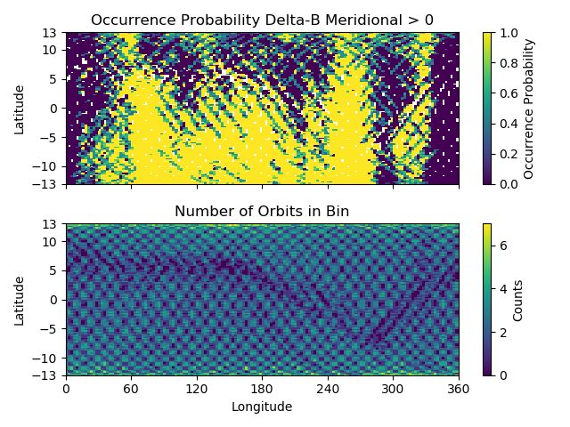
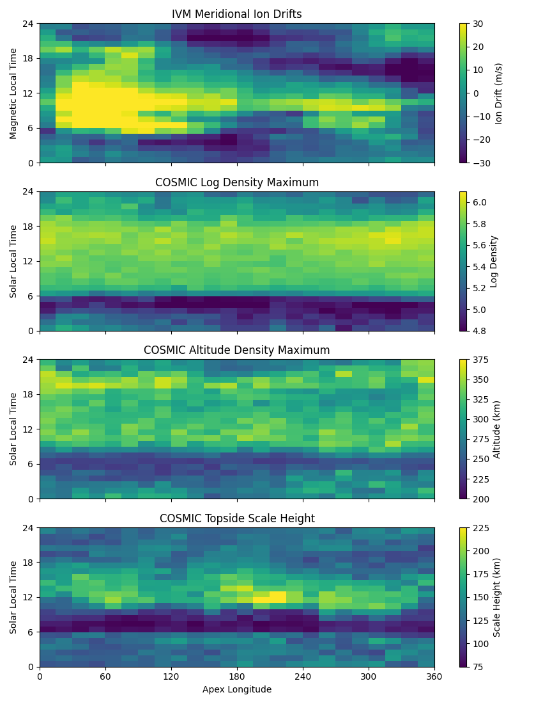
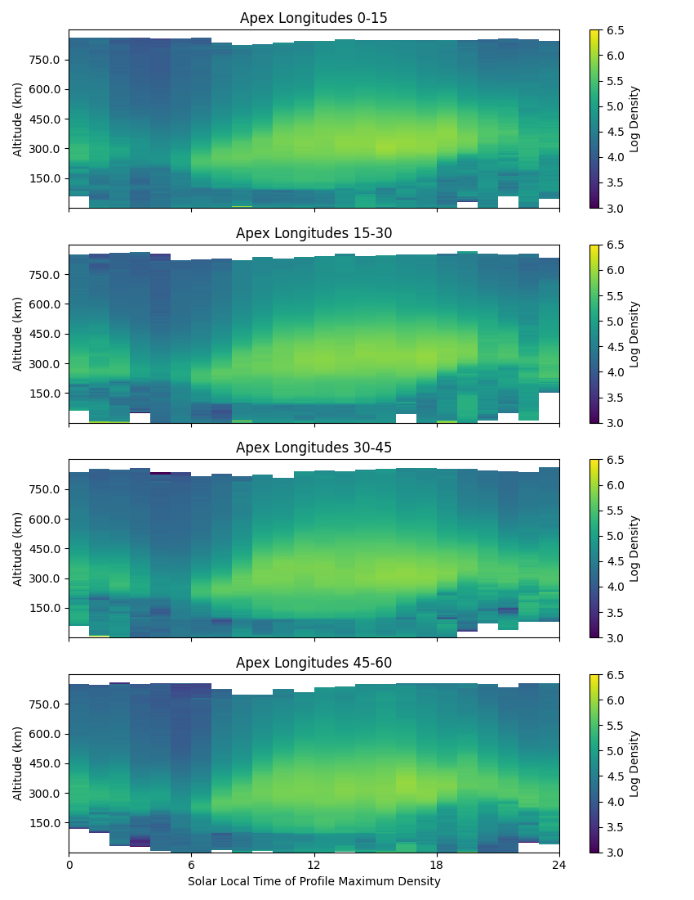

pysatSeasons Examples
=====================

pysat tends to reduce certain science data investigations to the construction
of a routine(s) that makes that investigation unique, a call to a seasonal
analysis routine, and some plotting commands. Several demonstrations are
offered in this section.

Seasonal Occurrence by Orbit
----------------------------

How often does a particular thing occur on a orbit-by-orbit basis? As an example,
let us calculate the occurrence of a positive perturbation in the meridional
component of the geomagnetic field as measured by the Vector Electric Field
Instrument (VEFI) onboard the Communication/Navigation Outage Forecasting
System (C/NOFS) satellite.  The full code can be found at:
`<https://github.com/pysat/pysatSeasons/blob/main/demo/ssnl_occurrence_by_orbit.py>`_

.. code:: python

    # Demonstrates iterating over an instrument data set by orbit and
    # determining the occurrence probability of an event occurring.

    import datetime as dt
    import os
    import matplotlib.pyplot as plt
    import numpy as np

    import pysat
    import pysatNASA
    import pysatSeasons

    # Ensure all pysatNASA data plugins are registered with pysat. Only needs
    # to be performed once per installation/upgrade.
    pysat.utils.registry.register_by_module(pysatNASA.instruments)

    # Set the directory where the plots will be saved. Setting nothing will put
    # the plots in the current directory
    results_dir = ''

    # Select C/NOFS VEFI DC magnetometer data, use longitude to determine where
    # there are changes in the orbit (local time info not in file)
    orbit_info = {'index': 'longitude', 'kind': 'longitude'}
    vefi = pysat.Instrument(platform='cnofs', name='vefi', tag='dc_b',
                            clean_level=None, orbit_info=orbit_info)

    # Define function to remove flagged values
    def filter_vefi(inst):
        idx, = np.where(inst['B_flag'] == 0)
        inst.data = inst[idx]
        return

    # Attach filtering function to `vefi` object.
    vefi.custom_attach(filter_vefi)

    # Set limits on dates analysis will cover, inclusive
    start = dt.datetime(2010, 5, 9)
    stop = dt.datetime(2010, 5, 15)

    # Check if data already on system, if not, download.
    if len(vefi.files[start:stop]) < (stop - start).days:
        vefi.download(start, stop)

    # Specify the analysis time limits using `bounds`, otherwise all VEFI DC
    # data will be processed.
    vefi.bounds = (start, stop)

    # Perform occurrence probability calculation.
    # Any data added by custom functions is available within analysis below.
    ans = pysatSeasons.occur_prob.by_orbit2D(vefi, [0, 360, 144], 'longitude',
                                             [-13, 13, 104], 'latitude',
                                             ['dB_mer'], [0.], returnBins=True)

    # A dict indexed by data_label is returned.
    ans = ans['dB_mer']

    # Plot occurrence probability
    f, axarr = plt.subplots(2, 1, sharex=True, sharey=True)

    # Mask for locations not observed.
    masked = np.ma.array(ans['prob'], mask=np.isnan(ans['prob']))

    # Plot occurrence probability
    im = axarr[0].pcolor(ans['bin_x'], ans['bin_y'], masked)
    axarr[0].set_title('Occurrence Probability Delta-B Meridional > 0')
    axarr[0].set_ylabel('Latitude')
    axarr[0].set_yticks((-13, -10, -5, 0, 5, 10, 13))
    axarr[0].set_ylim((ans['bin_y'][0], ans['bin_y'][-1]))
    plt.colorbar(im, ax=axarr[0], label='Occurrence Probability')

    # Plot number of orbits per bin.
    im = axarr[1].pcolor(ans['bin_x'], ans['bin_y'], ans['count'])
    axarr[1].set_title('Number of Orbits in Bin')
    axarr[1].set_xlabel('Longitude')
    axarr[1].set_xticks((0, 60, 120, 180, 240, 300, 360))
    axarr[1].set_xlim((ans['bin_x'][0], ans['bin_x'][-1]))
    axarr[1].set_ylabel('Latitude')
    plt.colorbar(im, ax=axarr[1], label='Counts')

    f.tight_layout()
    plt.savefig(os.path.join(results_dir, 'ssnl_occurrence_by_orbit_demo'))
    plt.close()

Result

The top plot shows the occurrence probability of a positive magnetic field
perturbation as a function of geographic longitude and latitude. The bottom
plot shows the number of times  the satellite was in each bin with data
(on per orbit basis). Individual orbit tracks may be seen. The hatched pattern
is formed from the satellite traveling North to South and vice-versa. At the
latitudinal extremes of the orbit the latitudinal velocity goes through zero
providing a greater coverage density. The satellite doesn't return to the same
locations on each pass so there is a reduction in counts between orbit tracks.
All local times are covered by this plot, over-representing the coverage of a
single satellite.

The horizontal blue band that varies in latitude as a function of longitude is
the location of the magnetic equator. Torque rod firings that help C/NOFS
maintain proper attitude are performed at the magnetic equator. Data during
these firings is excluded by the custom function attached to the ``vefi``
instrument object.

Seasonal Averaging of Ion Drifts and Density Profiles
-----------------------------------------------------

In-situ measurements of the ionosphere by the Ion Velocity Meter onboard C/NOFS
provides information on plasma density, composition, ion temperature, and ion
drifts. This provides a great deal of information on the ionosphere though this
information is limited to the immediate vicinity of the satellite. COSMIC GPS
measurements, with some processing, provide information on the vertical
electron density distribution in the ionosphere. The vertical motion of ions
measured by IVM should be reflected in the vertical plasma densities measured
by COSMIC. To look at this relationship over all longitudes and local times,
for magnetic latitudes near the geomagnetic equator, the code excerpts below
provides a framework for the user.  The full code can be found at
`<https://github.com/pysat/pysatSeasons/blob/main/demo/cosmic_and_ivm_demo.py>`_

Note the same averaging routine is used for both COSMIC and IVM, and that both
1D and 2D data are handled correctly. The demo code requires pysatCDAAC > 0.0.2.

.. code:: python

    # Instantiate IVM Object
    ivm = pysat.Instrument(platform='cnofs', name='ivm', tag='',
                           clean_level='clean')

    # Restrict measurements to those near geomagnetic equator.
    ivm.custom_attach(restrict_abs_values, args=['mlat', 25.])

    # Perform seasonal average
    ivm.bounds = (startDate, stopDate)
    ivmResults = pysatSeasons.avg.median2D(ivm, [0, 360, 24], 'alon',
                                           [0, 24, 24], 'mlt',
                                           ['ionVelmeridional'])

    # Create COSMIC instrument object. Engage supported keyword `altitude_bin`
    # to bin all altitude profiles into 3 km increments.
    cosmic = pysat.Instrument(platform='cosmic', name='gps', tag='ionprf',
                              clean_level='clean', altitude_bin=3)

    # Apply custom functions to all data that is loaded through cosmic
    cosmic.custom_attach(add_magnetic_coordinates)

    # Select locations near the magnetic equator
    cosmic.custom_attach(filter_values, args=['edmax_qd_lat', (-10., 10.)])

    # Take the log of NmF2 and add to the dataframe
    cosmic.custom_attach(add_log_density)

    # Calculates the height above hmF2 to reach Ne < NmF2/e
    cosmic.custom_attach(add_scale_height)

    # Perform a bin average of multiple COSMIC data products, from startDate
    # through stopDate. A mixture of 1D and 2D data is averaged.
    cosmic.bounds = (startDate, stopDate)
    cosmicResults = pysatSeasons.avg.median2D(cosmic, [0, 360, 24], 'edmax_qd_lon',
                                              [0, 24, 24], 'edmaxlct',
                                              ['ELEC_dens', 'edmaxalt',
                                               'lognm', 'thf2'])

    # The work is done, plot the results!

The top image is the median ion drift from the IVM, while the remaining plots
are derived from the COSMIC density profiles. COSMIC data does not come with
the location of the profiles in magnetic coordinates, so this information is
added using the nano-kernel.

.. code:: python

   cosmic.custom_attach(add_magnetic_coordinates)

call runs a routine that adds the needed information using the community
package ``apexpy``. Similarly, using custom functions, locations away from the
magnetic equator are filtered out and a couple new quantities are added.

There is a strong correspondence between the distribution of downward drifts
between noon and midnight and a reduction in the height of the peak ionospheric
density around local sunset. There isn't the same strong correspondence with the
other parameters but ion density profiles are also affected by production and
loss processes, not measured by IVM.

The median averaging routine also produced a series a median altitude profiles
as a function of longitude and local time. A selection are shown below.

There is a gradient in the altitude distribution over longitude near sunset.
Between 0-15 longitude an upward slope is seen in bottom-side density levels
with local time though higher altitudes have a flatter gradient. This is
consistent with the upward ion drifts reported by IVM. Between 45-60 the
bottom-side ionosphere is flat with local time, while densities at higher
altitudes drop steadily. Ion drifts in this sector become downward at night.
Downward drifts lower plasma into exponentially higher neutral densities,
rapidly neutralizing plasma and producing an effective flat bottom. Thus, the
COSMIC profile in this sector is also consistent with the IVM drifts.

Between 15-30 degrees longitude, ion drifts are upward, but less than the
0-15 sector. Similarly, the density profile in the same sector has a weaker
upward gradient with local time than the 0-15 sector.  Between 30-45 longitude,
drifts are mixed, then transition into weaker downward drifts than between
45-60 longitude. The corresponding profiles have a flatter bottom-side gradient
than sectors with upward drift (0-30), and a flatter top-side gradient than
when drifts are more downward (45-60), consistent with the ion drifts.